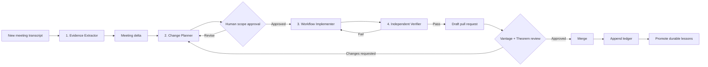

# Hazel Meeting-to-Workflow AI Loop

## Purpose

This workflow turns meeting transcripts into focused, evidence-backed updates to the Hazel onboarding workflow without redesigning unrelated parts of the experience. It gives Vantage and Theorem a shared record of decisions, approvals, open questions, implementation changes, and lessons from every iteration.

## Operating principle

AI prepares evidence, plans, patches, and verification reports. Humans approve scope and merge changes. No agent writes directly to `main`.

## Flow



## Agent roles

### 1. Evidence Extractor

Converts one transcript into a strict meeting delta containing only:

- confirmed decisions;
- approved changes;
- requested changes that still need approval;
- action items with explicitly stated owners and due dates;
- open questions;
- superseded decisions; and
- final takeaways.

Every claim must cite a transcript timestamp or section. Discussion is not a decision. Missing facts remain `unknown`; the agent must not infer them.

### 2. Change Planner

Compares the meeting delta with the current workflow, existing decisions, open questions, design contract, and previous iteration. It produces a minimal change manifest defining:

- authorized files and sections;
- exact requested behavior;
- protected regions and brand elements;
- acceptance criteria;
- source evidence; and
- required reviewers.

It must not request a general redesign or whole-page regeneration.

### 3. Workflow Implementer

Applies only an approved change manifest. It makes the smallest viable diff, reuses the existing HTML/CSS system, preserves unresolved questions and historical decisions, and stops when requirements conflict or cannot be traced to evidence.

### 4. Independent Verifier

Checks the implementation independently. It blocks the pull request when:

- files or sections outside the approved scope changed;
- logos, global CSS tokens, fonts, or page shell changed without approval;
- existing decisions or open questions disappeared;
- HTML structure is invalid;
- a claim lacks transcript evidence; or
- the rendered page changed outside approved regions.

## Human approval gates

1. **Scope approval:** Vantage and Theorem approve the change manifest before implementation.
2. **Merge approval:** Both sides review the verified draft pull request before it reaches `main`.
3. **Sensitive ambiguity:** Conflicting decisions, unknown owners, security changes, and brand changes always require explicit human resolution.

## Iteration memory

Each meeting creates an append-only folder under `04-ledger/meetings/`. It contains the meeting delta, summary, approved change manifest, verification report, and final diff. Even a no-change meeting creates a delta stating why no implementation was warranted.

`lessons.md` contains only durable operating rules that should change future agent behavior. Meeting-specific facts remain in their iteration record. Superseded decisions remain visible and link to their replacement.

## Repository structure

```text
.ai/
├── AGENTS.md
├── agents/
│   ├── evidence-extractor.md
│   ├── change-planner.md
│   ├── workflow-implementer.md
│   └── independent-verifier.md
├── contracts/
│   ├── meeting-delta.schema.json
│   ├── change-manifest.schema.json
│   ├── verification-report.schema.json
│   └── design-preservation.md
├── prompts/
│   └── run-meeting-loop.md
└── checks/
    ├── protected-workflow-elements.json
    └── verify-workflow-guardrails.py

04-ledger/
├── README.md
├── decisions.md
├── open-questions.md
├── lessons.md
└── meetings/
    └── YYYY-MM-DD-meeting-slug/
        ├── meeting-delta.json
        ├── summary.md
        ├── change-manifest.json
        ├── verification-report.json
        └── final-diff.md
```

## Definition of done

An iteration is complete only when its evidence is traceable, scope is approved, implementation is minimal, automated guardrails pass, visual review finds no unrelated changes, the PR is approved, and the ledger is appended.
